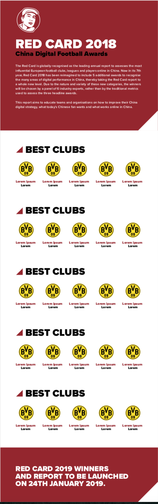

# Red Card Football Awards Website

A responsive web page designed for the Red Card Football Awards, showcasing the top football clubs awarded for their digital influence in China. Built with HTML, CSS, and Bootstrap, this page displays information about award-winning clubs, award categories, and a brief overview of the awards.

## Table of contents

- [Overview](#overview)
  - [The challenge](#the-challenge)
  - [Screenshot](#screenshot)
  - [Links](#links)
- [My process](#my-process)
  - [Built with](#built-with)
  - [What I learned](#what-i-learned)
  - [Continued development](#continued-development)
  - [Useful resources](#useful-resources)
- [Author](#author)
- [Acknowledgments](#acknowledgments)

## Overview

### The challenge

To create a web page that is both visually appealing and informative, highlighting the best European football clubs that excel in digital influence in China. The challenge was to structure the content in a way that visually engages users while being easy to navigate on any device.

### Screenshot

- **Red Card Football Awards Website**

### Links

- Solution URL: [https://github.com/HooriaSaeeda/-Red-Card-Football-Awards-Website.git](https://github.com/HooriaSaeeda/-Red-Card-Football-Awards-Website.git)
- Live Site URL: [ https://hooriasaeeda.github.io/Keefer_Bootstrap_conversion/]( https://hooriasaeeda.github.io/Keefer_Bootstrap_conversion/)

## My process

### Built with

- **HTML5**: Markup structure and content.
- **CSS3**: Custom styles for layout, fonts, and colors.
- **Bootstrap 5**: For responsive grid structure and utility classes.
- **Google Fonts**: Poppins font for text styling.

### What I learned

Working on this project helped deepen my understanding of responsive design, particularly:

- **Bootstrap Grid** : I used the grid system extensively to arrange content across different screen sizes, learning more about adjusting columns and spacing dynamically.
- **Media Queries** : Writing custom media queries to override Bootstrap and control layout shifts helped me refine my approach to mobile and tablet views.
- **Typography and Spacing** : Finding the right font weights and sizes for readability while maintaining the aesthetic required balancing utility classes and custom styles.

### Continued development

In future projects, I plan to:

- Implement more dynamic, data-driven elements such as awards data pulled from JSON or a CMS.
- Experiment with CSS animations to make the page more interactive, especially for highlighting award categories.
- Focus on improving accessibility with proper ARIA roles and a more comprehensive color contrast strategy.

### Useful resources

- [Bootstrap Documentation](https://getbootstrap.com/docs/5.0/getting-started/introduction/) - Invaluable for learning about responsive grid layout and utilities.
- [Google Fonts](https://fonts.google.com/) - Great resource for enhancing typography.

## Author

- Github - [hoor23](https://github.com/hoor23)
- Frontend Mentor - [hoor23](https://www.frontendmentor.io/profile/hoor23)
- Linkedin - [Hoor Seyda](linkedin.com/in/hoor-seyda-901176222)

## Acknowledgments

Special thanks to the online frontend development community for providing valuable resources and inspiration. Also, thanks to friends and colleagues who provided feedback during development.